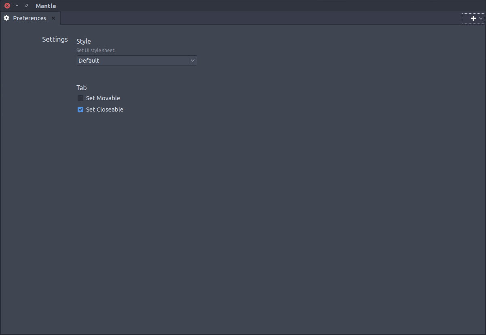

# Mantle


[](https://github.com/takavfx/Mantle/blob/master/LICENSE.md)


## Feature

Mantle is a standalone tool base sets.
This is simply made to make develop, release and support easier as organized.
Mantle contains basic dynamic widget import from `packages` directory.
So we just have to follow a few rules to let Mantle import our toools.

## Usage

In the packages directory, Mantle automatically loads packages inside of it.
The required function which has to be written in packages' `__init__.py`:

```python
import os
from PySide import QtGui

import module

_CURRENTPATH = os.path.dirname(os.path.realpath(__file__))

def getWidget(parent):
    widget = gui.SubmitterWindow(parent)
    icon   = QtGui.QIcon(os.path.join(_CURRENTPATH, 'static', 'icon.svg'))
    title  = 'ModuleTitle'
    return widget, icon, title
```

`getWidget` : [REQUIRED] This loads widget from package modules.

`widget`    : [REQUIRED] This returns widget that will be automatically added in the Mantle tab list.

`icon`      : [OPTIONAL] This returns icon QtGui.QIcon object. This can be None if icon is not prepared.

`title`     : [REQUIRED] This returns title name that is displayed as Tab Name.


## Images


